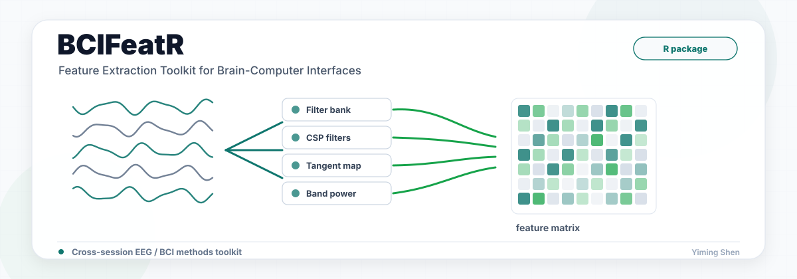

# BCIFeatR

<p align="center">
  
</p>

<p align="center">
  <a href="https://github.com/Yiming-S/BCIFeatR/actions/workflows/R-CMD-check.yaml"></a>
  
  <a href="LICENSE"></a>
</p>

**BCIFeatR** is an R toolkit for extracting features from multi-channel EEG
trials in offline brain-computer interface (BCI) decoding pipelines. Its main
goal is a leakage-safe, unified train/test interface: fit feature-specific state
on training trials once, then reuse the fitted object unchanged on held-out
trials.

```r
library(BCIFeatR)

# x_train/x_test: lists of trial matrices, each samples x channels
# y_train: factor or coercible class labels
fit <- feat_ex_train(x_train, y_train, feature = "CSP",
                     params = list(ncomps = 4L))

X_train <- fit$features
X_test  <- feat_ex_test(x_test, fit$object, feature = "CSP")
```

`feat_ex_train()` and `feat_ex_test()` are snake_case aliases for the original
`featEx4Train()` and `featEx4Test()` entry points; the legacy names remain fully
supported.

## Why BCIFeatR?

- **One train/test contract** for log-variance, CSP/FBCSP/FBCSSP, tangent-space,
  Riemannian, ATM, band-power, Hjorth, MVAR, and MSVAR features.
- **Deterministic test transforms** that reuse train-time CSP filters,
  preprocessing statistics, tangent references, and generative models.
- **BCI-oriented utilities** for shrinkage covariance estimation, filter banks,
  feature selection, lightweight classifiers, SimAM attention, and MCCA
  multi-view fusion.
- **Real-data smoke testing** on Zhou2016 and BNCI2014-004 motor-imagery data,
  with results in the expected published range.

## Installation

```r
# Install dependencies first, especially for source/local installs
install.packages("gsignal")

# Install from GitHub
install.packages("remotes")
remotes::install_github("Yiming-S/BCIFeatR", dependencies = TRUE)
```

## Supported feature methods

| Method | Description |
|--------|-------------|
| `logvar` | Log-variance of each channel |
| `logvar_pca` | Log-variance after PCA projection |
| `CSP` | Common Spatial Patterns |
| `FBCSP` | Filter-Bank CSP |
| `FBCSSP` | Filter-Bank CSSP with time-delay embedding |
| `TS` | Tangent-space projection from covariance matrices |
| `ACM_TS` | Augmented Covariance Matrix plus tangent space |
| `Riemannian` | Riemannian mean plus log-map, with optional geodesic/FGDA filtering |
| `ATM` | Avalanche Transition Matrix |
| `bandpower` | Per-channel log or relative band power over a frequency-band bank |
| `Hjorth` | Per-channel Hjorth activity, mobility, and complexity |
| `MVAR` | Per-trial vector-autoregression coefficients plus residual log-variance |
| `MSVAR` | Per-class Markov-switching VAR log-likelihood features |

## Data format

- **Trials** (`x`): a list of numeric matrices, each `samples x channels`.
  All trials must have the same number of channels.
- **Labels** (`y`): a factor or coercible vector with one entry per trial.
- **Sessions**: for multi-session inputs, pass lists of trial-lists and
  label-vectors. Each session is fitted/transformed independently using the
  same feature method.

```r
multi_fit <- feat_ex_train(
  x = list(session1_trials, session2_trials),
  y = list(session1_labels, session2_labels),
  feature = "logvar",
  params = list()
)
```

## Classifiers

BCIFeatR includes lightweight classifiers for package-level experiments and
baselines.

```r
# Riemannian Minimum Distance to Mean, operating directly on raw trials
mdm <- mdm_train(x_train, y_train, metric = "logeuclid")
y_hat <- predict(mdm, x_test)
dists <- predict(mdm, x_test, type = "distance")

# Markov-switching VAR generative classifier
msv <- msvar_train(x_train, y_train, M = 2L, p = 1L, seed = 1L)
y_hat <- predict(msv, x_test)
ll <- predict(msv, x_test, type = "loglik")
```

## Multi-view fusion

Use regularized SUMCOR multiset CCA to align several feature views from the same
trials into a shared representation.

```r
V1 <- feat_ex_train(x_train, y_train, "logvar", list())$features
V2 <- feat_ex_train(
  x_train, y_train, "bandpower",
  list(fs = 250, frequency_bands = list(c(8, 13), c(13, 30)))
)$features

mc <- mcca_train(list(V1, V2), ncomp = 4L)
fused_train <- mcca_transform(mc, list(V1, V2))$consensus
```

## Preprocessing and attention

Channel preprocessing (`none`, `center`, `scale`, or `whiten`) and optional
parameter-free SimAM attention are applied before feature extraction through
`params`.

```r
fit <- feat_ex_train(
  x_train, y_train, "TS",
  params = list(cov_type = "oas",
                preprocess = "whiten",
                simam = "vanilla")
)
```

## Real-data validation

The package has been exercised end-to-end on two independent motor-imagery EEG
datasets using leakage-safe session-disjoint protocols:

| Dataset | Protocol | Best method | Best balanced accuracy |
|---|---|---:|---:|
| Zhou2016, 4 subjects, 14 channels | leave-one-session-out | CSP | 0.81 +/- 0.09 |
| BNCI2014-004, 9 subjects, 3 channels | train T-sessions, test E-sessions | FBCSP | 0.76 +/- 0.12 |

See the
[real-data benchmark report](https://github.com/Yiming-S/BCIFeatR/blob/main/benchmarks/BCIFeatR_realdata_report.md)
for protocols, per-subject results, and notes from robustness testing.

## Testing

```r
devtools::test()

# Full source-package check
R CMD build .
R CMD check BCIFeatR_*.tar.gz
```

## References

The Markov-switching VAR engine behind the `MSVAR` feature and the
`msvar_train()` / `msvar_predict()` classifier is adapted from the Degras Lab
`msvar` implementation:

> Degras, D., Ting, C.-M., & Ombao, H. (2022). Markov-switching state-space
> models with applications to neuroimaging. *Computational Statistics & Data
> Analysis*.

## License

MIT - see [LICENSE](LICENSE) for details.
